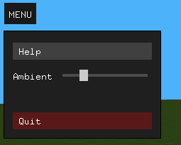
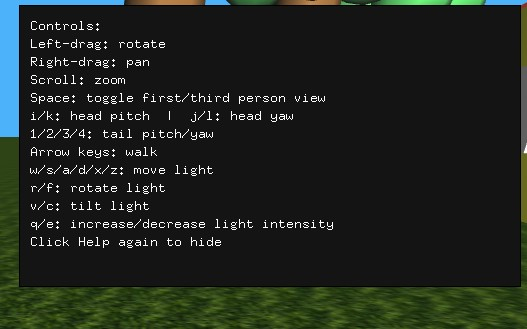
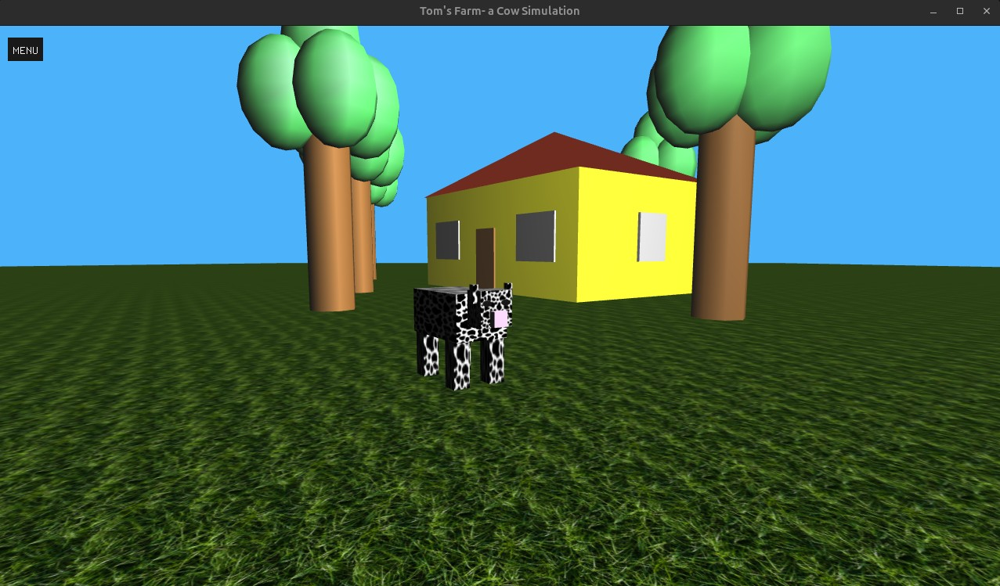
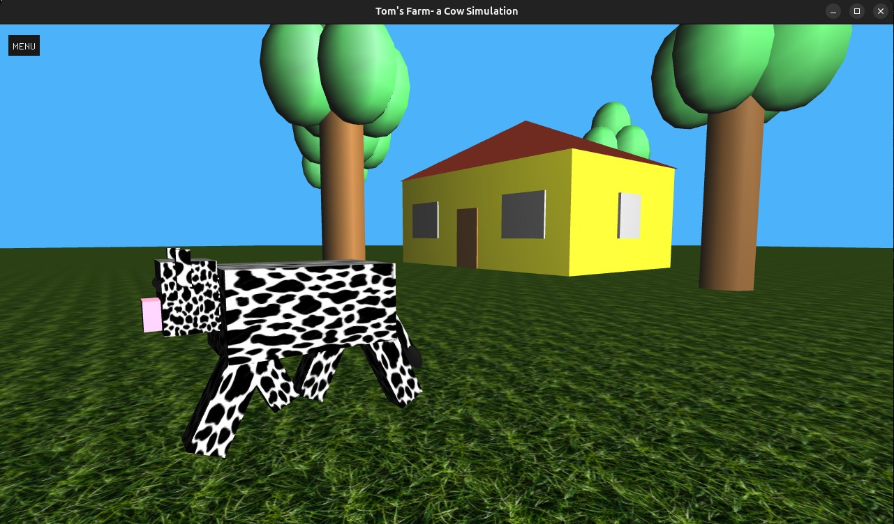
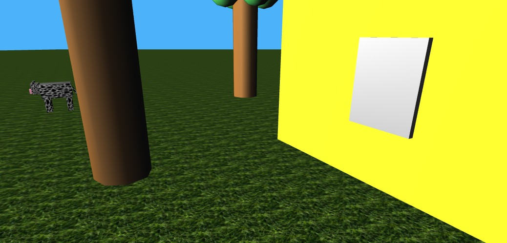

# Tom's Farm- a Cow Simulation

This is summary of the project (Computer Graphics).

An extra feature was added: the legs move (using sin() for smoothness) as the cow walks.

## The project:
* implements OpenGL functions to create shapes, lighting, a menu and user controls (via keyboard and/or mouse.
* Uses an external asset- stb_image.h for loading texture files onto the cow and floor (grass).
* Implements some basic math functions to control the view and object (cow) transformations. Main libraries used: GL/glut, cmath.

### Controls:
* Left-drag: rotate
* Right-drag: pan
* Scroll: zoom
* Space: toggle first/third person view
* i/k: head pitch | j/l: head yaw
* 1/2/3/4: tail pitch/yaw
* Arrow keys: walk
* w/s/a/d/x/z: move light
* r/f: rotate light
* v/c: tilt light
* q/e: increase/decrease light intensity
* Click Help again to hide

### Menu layout:

    **Ambient lighting intensity can be controlled by the user.**

### Help layout:

    **All controls are shown.**

### Main farm screenshots:

### Shiny light-silver window (metallic, you know... for security):

